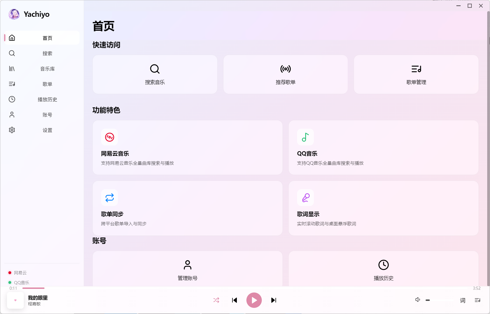
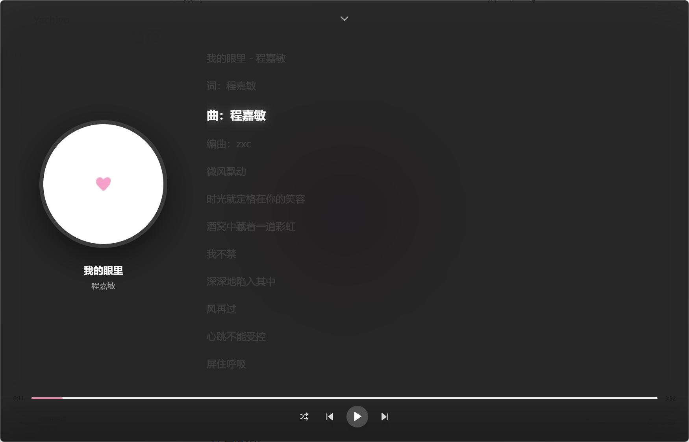
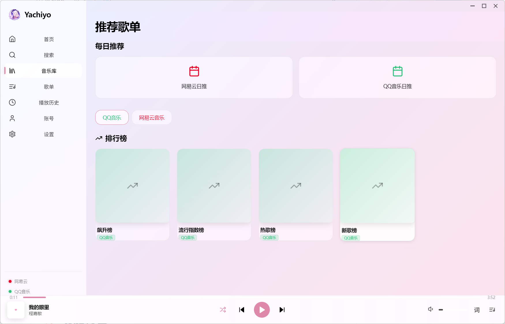
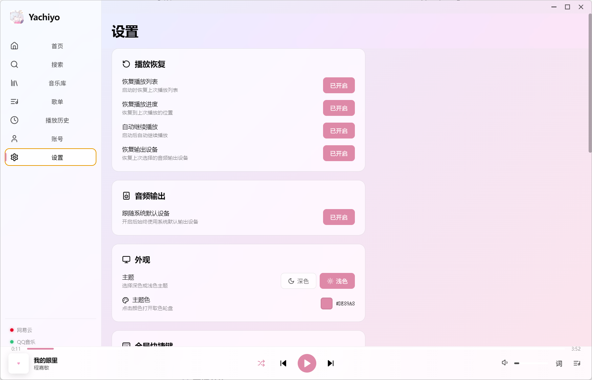

<div align="center">

# 🎵 Yachiyo

### Elegant Music Experience

**QQ Music × NetEase Cloud Music**

Unified · Fast · Beautiful

<br>


</div>

---

# 📷 软件预览

| 首页 | 歌词 |
|------|------|
|  |  |

| 每日推荐 | 设置 |
|------|------|
|  |  |

---

# ✨ 功能特色

## 🎶 本地音乐

- ✔ 极速扫描本地音乐
- ✔ 多格式支持
- ✔ 播放列表
- ✔ 收藏歌曲
- ✔ 历史播放
- ✔ 搜索音乐

---

## 🌸 每日推荐

登录音乐平台即可获取每日推荐。

目前支持：

- 网易云音乐
- QQ 音乐

未来还将持续扩展更多平台。

---

## 👤 多平台账号

支持多个账号登录：

- 网易云音乐
- QQ 音乐

无需频繁切换软件。

---

## 🎼 歌词系统

支持：

- 自动获取歌词
- 实时同步
- 桌面歌词
- 滚动歌词
- 歌词窗口独立显示

---

## 🎧 输出设备切换

无需进入 Windows 设置。

播放器内即可快速切换：

- 扬声器
- 蓝牙耳机
- HDMI
- USB DAC
- 其它 Windows 音频设备

---

## 💾 播放恢复

程序异常退出或重新打开后，将自动恢复：

- 上次播放歌曲
- 播放位置
- 播放状态
- 播放列表

继续播放，无需重新寻找歌曲。

---

## 🖥 Windows 深度集成

支持：

- 系统托盘
- 开机自启
- 缩略图播放控制（Thumbnail Toolbar）
- 全局快捷键
- 多窗口
- 桌面歌词

更符合 Windows 用户的使用习惯。

---

# 🚀 安装

前往 **Releases** 下载最新版本。

```text
Yachiyo-Setup.exe
```

双击安装即可开始使用。

---

# 📂 项目结构

```text
src
├── accounts          # 音乐平台账号
├── database          # 数据存储
├── ipc               # Electron IPC
├── lyrics            # 歌词模块
├── playlist          # 播放列表
├── providers         # 每日推荐
├── streaming         # 在线播放
├── renderer          # 前端
├── preload           # Preload
└── main              # 主进程
```

---

# 🛠 技术栈

| 技术 | 用途 |
|------|------|
| Electron | 桌面应用 |
| React | UI 框架 |
| TypeScript | 开发语言 |
| Node.js | Runtime |
| SQLite | 数据存储 |
| Windows API | 系统集成 |

---

# 📋 Roadmap

## ✅ 已完成

- 本地音乐
- 播放列表
- 网易云登录
- QQ 音乐登录
- 每日推荐
- 在线歌词
- 桌面歌词
- 输出设备切换
- 自动恢复播放
- 开机自启
- Windows 托盘

## 🚧 开发中

- 更多音乐平台
- 自定义主题
- 均衡器
- 插件系统
- 播放统计
- 歌词翻译

---

# ❤️ 致谢

感谢所有开源项目及贡献者。

包括但不限于：

- Electron
- React
- TypeScript
- Node.js

以及所有为 Yachiyo 提出建议、提交 Issue、贡献代码的开发者。

---

# 🤝 贡献

欢迎提交：

- Issue
- Pull Request
- Bug Report
- Feature Request

如果喜欢这个项目，欢迎点一个 **⭐ Star** 支持！

---

# 📄 License

本项目仅供学习与交流使用。

请遵守各音乐平台接口协议及相关版权规定。
