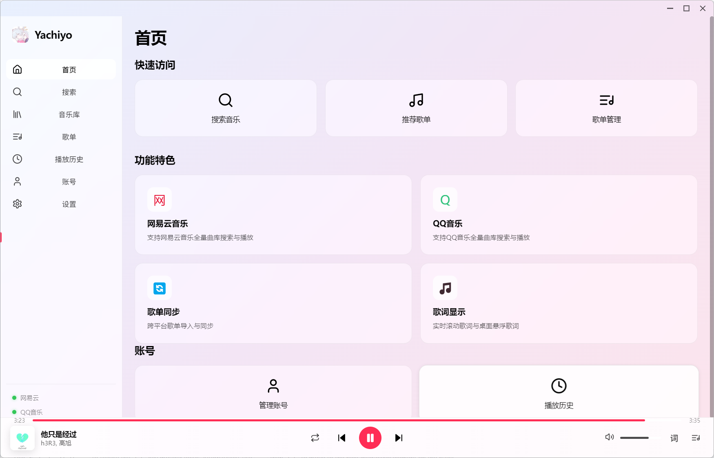

<div align="center">

# 🎵 Yachiyo

### Elegant Music Experience

QQ Music × NetEase Cloud Music

Unified · Fast · Beautiful

<br>


</div>

---

# 简体中文

## 📖 项目介绍

Yachiyo 是一款现代化跨平台音乐播放器，旨在提供优雅、统一且高效的音乐体验。

通过整合 **QQ音乐** 与 **网易云音乐**，用户无需频繁切换客户端，即可在一个应用内完成搜索、播放、歌单管理与歌词查看。

---

## 🌟 项目亮点

* 🎵 QQ音乐支持
* 🎵 网易云音乐支持
* 🔍 全平台统一搜索
* 📚 歌单与音乐库管理
* 🎧 高品质音乐播放
* 📝 实时歌词同步
* 🖥️ 桌面悬浮歌词
* 🌙 深色 / 浅色主题
* ⌨️ 全局媒体快捷键
* ⚡ Electron + React + TypeScript

---

## 📸 界面展示

### 设置页面

<p align="center">
  
</p>

---

## 🎧 功能列表

### 音乐平台

* 网易云音乐
* QQ音乐
* 多账号支持

### 播放控制

* 播放 / 暂停
* 上一曲 / 下一曲
* 音量控制
* 播放进度调整
* 歌词同步显示

### 歌词功能

* 实时歌词
* 桌面悬浮歌词
* 快捷显示/隐藏

### 个性化

* 浅色主题
* 深色主题
* 现代化 Fluent Design 风格界面

---

## ⌨️ 默认快捷键

| 功能      | 快捷键             |
| ------- | --------------- |
| 播放 / 暂停 | Ctrl + Alt + F5 |
| 下一首     | Ctrl + Alt + →  |
| 上一首     | Ctrl + Alt + ←  |
| 音量增加    | Ctrl + Alt + ↑  |
| 音量减少    | Ctrl + Alt + ↓  |
| 显示/隐藏歌词 | Ctrl + Alt + L  |

---

## 🏗️ 架构设计

```text
                Yachiyo
                    │
        ┌───────────┴───────────┐
        │                       │
     QQ Music            NetEase Cloud
        │                       │
        └───────────┬───────────┘
                    │
              Music Service
                    │
               React UI
                    │
                Electron
```

---

## 🛠️ 技术栈

| 技术         | 用途     |
| ---------- | ------ |
| Electron   | 桌面应用框架 |
| React      | 前端框架   |
| TypeScript | 类型系统   |
| Node.js    | 运行环境   |
| Vite       | 构建工具   |

---

## 🚀 快速开始

### 克隆项目

```bash
git clone https://github.com/firefly20041001/Yachiyo.git
```

### 进入项目

```bash
cd Yachiyo
```

### 安装依赖

```bash
npm install
```

### 开发运行

```bash
npm run dev
```

### 打包构建

```bash
npm run build
```

---

## 📦 下载

前往 Releases 页面下载最新版本：

https://github.com/firefly20041001/Yachiyo/releases

---

## 🤝 贡献

欢迎提交：

* Pull Request
* Issue
* Feature Request

如果你喜欢这个项目，欢迎点一个 ⭐ Star 支持开发。

---

## ⚠️ 免责声明

本项目仅供学习与研究使用。

所有音乐版权归对应平台及版权方所有。

请遵守 QQ音乐、网易云音乐 以及当地法律法规的相关规定。

---

## 📄 License

Apache License
